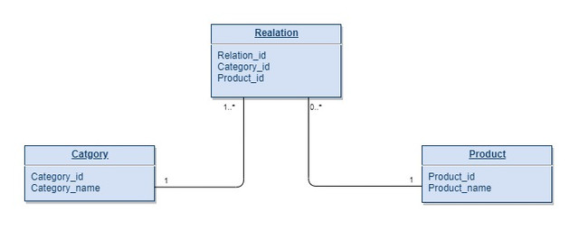

# TestForMIdBoX

Запрос SQL для выборки данных в соотношении "многие ко многим"

## Описание
База данных содержит продукты и категории. Одному продукту может соответствовать много категорий, в одной категории может быть много продуктов. 
## Струкутра БД
Промежуточная таблица Realation предназначена для реализации отношения "многие ко многим"

## Решение

**Тестовая таблицы**

Category

| categoty_id | category_name |
|:-----------:|:-------------|
|      1      | Office        |
|      2      | Street        |
|      3      | Home          |

 Product

| product_id |  product_name  |
|:----------:|:--------------|
|      1     | phone          |
|      2     | coffee machine |
|      3     | umbrella       |
|      4     | bed            |
|      5     | hat            |
|      6     | tribune        |

 Relation

| relatin_id | category_id | product_id |
|:----------:|:-----------:|:----------:|
|      1     |      1      |      1     |
|      2     |      1      |      2     |
|      3     |      2      |      3     |
|      4     |      3      |      1     |
|      5     |      3      |      2     |
|      6     |      3      |      4     |
|      7     |      2      |      5     |

 

**1 Вариант**
Поиск связей начинается от имеющихся продуктов в таблице Product

    SELECT product_name, category_name
        FROM [SQL_Test].dbo.Product
    LEFT JOIN [SQL_Test].dbo.Relation
		ON  Product.product_id = Relation.product_id
	LEFT JOIN [SQL_Test].dbo.Category
		ON Relation.category_id = Category.category_id

 Результат

|  product_name  | category_name |
|:--------------|:-------------:|
| phone          | Office        |
| phone          | Home          |
| coffee machine | Office        |
| coffee machine | Home          |
| umbrella       | Street        |
| bed            | Home          |
| hat            | Street        |
| tribune        | NULL          |

**2 Вариант**
Поиск связей начинается от имеющих категорий в таблице Category и дополнительно включаются все продукты, которые не имеют связей с таблицей Relation

    SELECT category_name, product_name
        FROM [SQL_Test].dbo.Category
	INNER JOIN [SQL_Test].dbo.Relation
		ON Category.category_id = Relation.category_id
	RIGHT JOIN [SQL_Test].dbo.Product
		ON Relation.product_id = Product.product_id

 Результат

| category_name | product_name   |
|:-------------:|----------------|
| Office        | phone          |
| Home          | phone          |
| Office        | coffee machine |
| Home          | coffee machine |
| Street        | umbrella       |
| Home          | bed            |
| Street        | hat            |
| NULL          | tribune        |